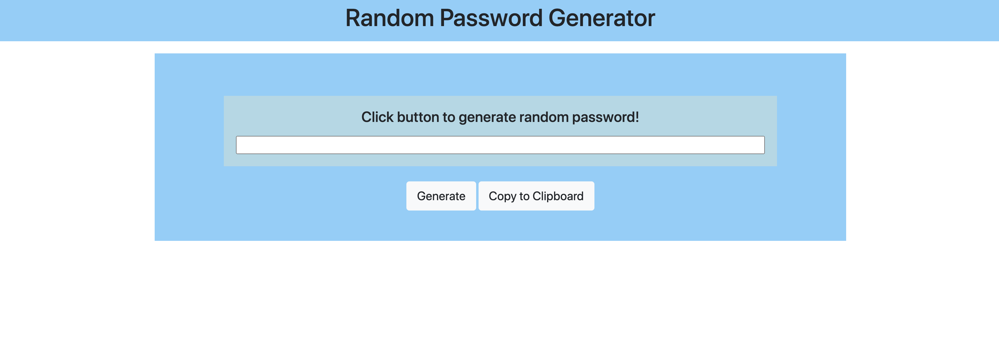

# password-generator
About the project:

Generating random password when button is clicked based on user-selected prompts for quick and secure password.

Image preview:

Descriptions of Project:

-Semantic HTML elements are used.

-Structures are in logical structures in positioning and styling.

-Bootstrap is used for nav bars.

-Booostrap grid system is used for responsive layouts.

-Java Script is used

    -function
    -object
    -math
    -booleans
    -loop for 
    -arrays
    
-Deployed Link:

https://juleeb.github.io/password-generator/

